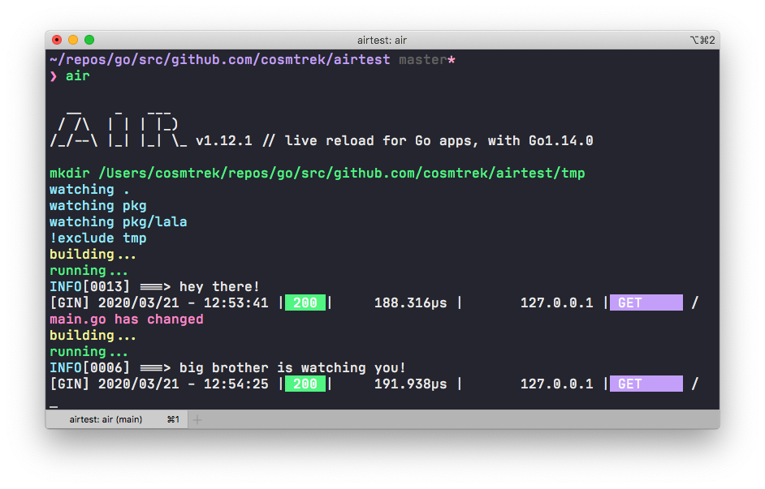

[Air](https://github.com/cosmtrek/air)
[](https://circleci.com/gh/cosmtrek/air/tree/master)
[](https://www.codacy.com/app/cosmtrek/air?utm_source=github.com&utm_medium=referral&utm_content=cosmtrek/air&utm_campaign=Badge_Grade)
[](https://goreportcard.com/report/github.com/cosmtrek/air)



:fire::fire::fire: [JOB HIRING](https://github.com/cosmtrek/air/issues/59)

## 动机

When I get started with developing websites in Go and [gin](https://github.com/gin-gonic/gin) framework, it's a pity
that gin lacks live-reloading function. In fact, I tried [fresh](https://github.com/pilu/fresh) and it seems not much
flexible, so I intended to rewrite it in a better way. Finally, Air's born. In addition, great thanks to
[pilu](https://github.com/pilu), no fresh, no air :)

Air is yet another live-reloading command line utility for Go applications in development. Just `air` in your project
root directory, leave it alone, and focus on your code.

> 注意: 这个工具有无关的 hot-deploy 进行生产。

## 特征

- Colorful log output
- Customize build or binary command
- Support excluding subdirectories
- Allow watching new directories after Air started
- Better building process

## 安装

### Go

安装的经典方法

```bash
go get -u github.com/cosmtrek/air
```

### macOS

```bash
curl -fLo air https://git.io/darwin_air
```

### Linux

```bash
curl -fLo air https://git.io/linux_air
```

### Windows

```bash
curl -fLo air.exe https://git.io/windows_air
```

P.S. Great thanks mattn's [PR](https://github.com/cosmtrek/air/pull/1) for supporting Windows platform.

### Docker way

Please pull this docker image [cosmtrek/air](https://hub.docker.com/r/cosmtrek/air).

```bash
docker run -it --rm \
    -w "<PROJECT>" \
    -e "air_wd=<PROJECT>" \
    -v $(pwd):<PROJECT> \
    -p <PORT>:<APP SERVER PORT> \
    cosmtrek/air
    -c <CONF>
```

For example, one of my project runs in docker:

```bash
docker run -it --rm \
    -w "/go/src/github.com/cosmtrek/hub" \
    -v $(pwd):/go/src/github.com/cosmtrek/hub \
    -p 9090:9090 \
    cosmtrek/air
```

## 用法

对于不太打字, 您可以添加`alias air='~/.air'`到您的`.bashrc` 或 `.zshrc`.

```bash
go env
...
GOPATH="/Users/user-home/go"
...
```

编辑.zshrc

```bash
vim .zshrc
...
alias air='~/go/bin/air
```

首先进入你的项目

```bash
cd /path/to/your_project
```

最简单的用法是运行

```bash
# 首先找到`.air.conf`在当前目录下，如果没有找到，使用默认值
air -c .air.conf
```

虽然我倾向于第二种方式

```bash
# 1. 创建一个新文件
touch .air.conf

# 2. `air.conf.example`粘贴到这个文件, 并**修改它**以满足您的需求.

# 3. 用你的配置运行`air`. 如果文件名是'.air.conf`，只需运行`air`。
air
```

请参阅完整 [air_example.conf](air_example.conf)

### 调试

`air -d` 打印所有日志。

## 开发

请注意，它需要 `Go 1.13+`，因为我用`go mod`管理的依赖关系。

```bash
# 1. fork this project

# 2. clone it
mkdir -p $GOPATH/src/github.com/cosmtrek
cd $GOPATH/src/github.com/cosmtrek
git clone git@github.com:<YOUR USERNAME>/air.git

# 3. install dependencies
cd air
make ci

# 4. explore it and happy hacking!
make install
```

BTW: 引入请求欢迎〜

## 赞助

<a href="https://www.buymeacoffee.com/36lcNbW" target="_blank"></a>

巨大的感谢以下的支持者。 我一直记得你的好意。

- Peter Aba

## 证书

[GNU 通用公共许可证 3.0 版](LICENSE)
